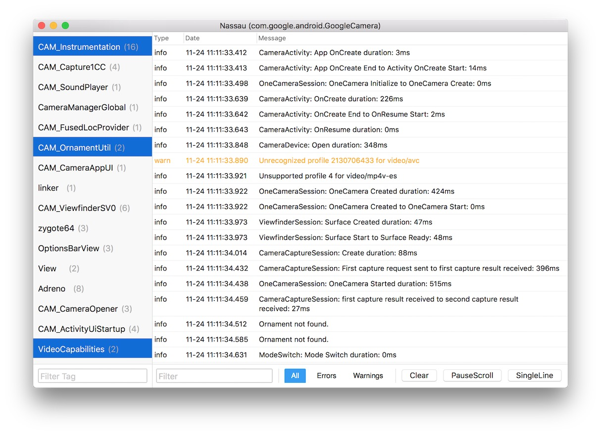

## What is Nassau
Nassau is a mac tool written in Swift 4 to make it easier to watch logcat's logs. a bit weird, ha~

## Why Create this Tool
Logcat’s Log is very useful when developing android apps. but there’s not an easy way to efficiently use these information. pidcat is great and convenience, but lack some key features, like cycle through tags.

so I think there should be a GUI tool to make use of logcat’s logs, that’s why Nassau is created.

## Features
* Auto Detect Top App.
* Can switch to search keyword instead of certain app’s log mode.
* Select multi tags. 
* Filter tags by keyword.
* Filter certain tag’s logs by keywords and log level.
* Switch multiline / single line. using single line to watch more Logs.
* Group by tags, so it’s easier to have a bird view.
* Show tags count, if some tag’s number is to high, maybe something wrong happened.

## Install and Use
make sure `adb` is correctly installed, if it’s location is not `~/Library/Android/sdk/platform-tools/adb` , you can change it in `Preferences...`

you can find download link in `releases` , after install, plug in an Android Device, open an app, the logger GUI should display.

one more thing: mac 10.12 is required, lower version maybe work, but haven't tested.

## License
Nassau is available under the MIT license. See the LICENSE file for more info.
